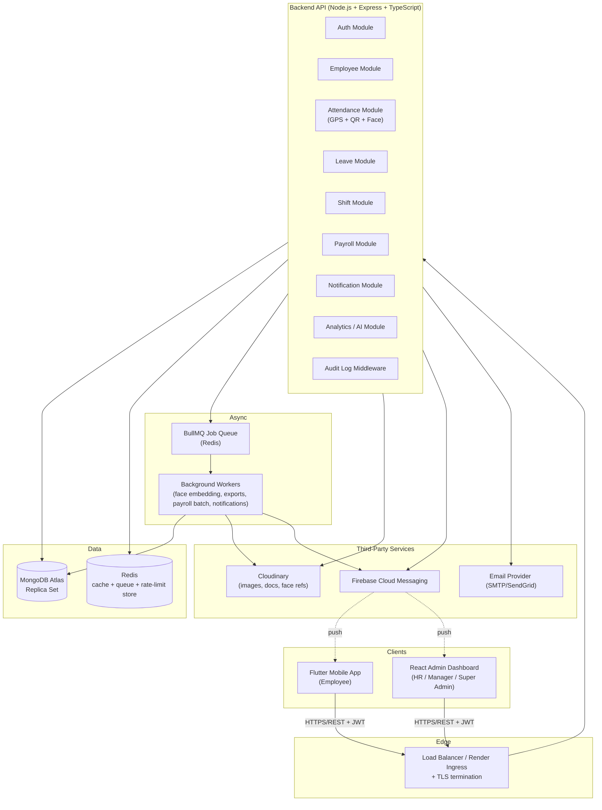

# 01 — Software Architecture

## 1. Overview

**AI Management System** is an enterprise workforce management platform composed of three independent client/server-adjacent projects sharing one backend API and one database:

| Project | Tech | Consumers |
|---|---|---|
| `backend/` | Node.js + Express + TypeScript + MongoDB | Mobile app, Admin dashboard, third-party webhooks |
| `admin-dashboard/` | React + Vite + TypeScript + Tailwind | HR, Managers, Super Admins (browser) |
| `mobile-app/` | Flutter (Clean Architecture + Riverpod) | Employees (Android/iOS) |

Core capabilities: JWT auth with RBAC, GPS-geofenced attendance, QR attendance, on-device face recognition, offline-first attendance capture with sync, leave/shift/payroll management, push notifications, analytics, and AI-assisted anomaly detection.

## 2. Architectural Style

**Modular monolith on the backend, offline-first client architecture on mobile, thin reactive SPA on web.**

Rationale:
- A single Express service organized into strict **feature modules** (`attendance`, `employees`, `leaves`, `payroll`, `shifts`, `face-recognition`, `notifications`, `analytics`) gives microservice-style separation of concerns without the operational overhead (service discovery, distributed transactions, multi-repo CI) that a workforce app of this scale doesn't need yet.
- Each module is internally layered (`route → controller → service → repository → model`) and only talks to other modules through their **service** layer (never reaching into another module's model directly), so it can be extracted into a standalone service later (e.g., `face-recognition` as a separate Python/Node microservice once embedding volume justifies it) without a rewrite.
- Heavy/blocking work (face embedding generation, PDF/Excel export, payroll batch runs) is pushed to a **job queue** (BullMQ + Redis) so the API stays responsive.

## 3. High-Level Component Diagram



## 4. Backend Layered Architecture (per module)

```
routes/        → HTTP verbs + path + auth/role middleware, zero business logic
controllers/   → parse/validate request, call service, shape response
services/      → business logic, orchestration, transactions
repositories/  → Mongoose queries only, no business logic
models/        → Mongoose schemas, indexes, hooks
validators/    → Zod/Joi request schemas
dto/           → response shaping / type contracts shared with frontend (via OpenAPI types)
```

This keeps controllers thin and testable, and lets `services/` be unit-tested without spinning up Express or a real DB (repositories mocked).

## 5. Client Architectures

### 5.1 Mobile (Flutter) — Clean Architecture
```
presentation (widgets, Riverpod providers/notifiers)
        ↓ depends on
domain (entities, use cases, repository interfaces)
        ↑ implemented by
data (remote data source [Dio], local data source [Hive/SQLite], repository impl, DTO ↔ entity mappers)
```
Offline-first: every mutating action (attendance punch, leave apply) writes to local storage first (optimistic), enqueues a **sync job**, and reconciles with the server when connectivity returns (see [08 — Sequence Diagrams](08-sequence-diagrams.md#5-offline-attendance-sync)).

### 5.2 Admin Dashboard (React) — Feature-sliced
```
app/          → router, providers, layout shells
features/     → one folder per domain (attendance, employees, leaves, payroll, shifts, analytics)
                each: api/ (axios hooks), components/, hooks/, types/
shared/       → ui kit, utils, constants, axios instance with interceptors
```
Data fetching via TanStack Query on top of Axios (cache, retries, background refresh) — not hand-rolled `useEffect` fetching.

## 6. Cross-Cutting Concerns

| Concern | Approach |
|---|---|
| AuthN/AuthZ | JWT access (15 min) + refresh (7 d, rotated, stored hashed in DB), RBAC middleware per route |
| Validation | Zod schemas at the controller boundary, shared types generated for frontend |
| Error handling | Central `AppError` class + Express error-handling middleware → consistent `{ success, error: { code, message } }` envelope |
| Logging | Winston (JSON in prod, pretty in dev) + request-id correlation, shipped to a log sink |
| Rate limiting | `express-rate-limit` backed by Redis, stricter on `/auth/*` and `/attendance/*` |
| Auditing | Mongoose post-hooks + explicit `audit.log()` calls on sensitive actions → `AuditLogs` collection |
| Caching | Redis for geofence lookups, shift lookups, dashboard aggregates (TTL 60–300s) |
| File storage | Cloudinary (never local disk) — profile photos, documents, face reference images |
| Background jobs | BullMQ queues: `face-embedding`, `payroll-run`, `report-export`, `notification-fanout` |
| Real-time | Socket.IO namespace `/live` for the live attendance dashboard (Phase enterprise extra) |

## 7. Non-Functional Requirements

| Attribute | Target |
|---|---|
| Availability | 99.5% (single-region Render + Atlas, acceptable for target scale) |
| API p95 latency | < 300 ms for CRUD, < 1.5 s for face verification |
| Concurrent users | 1,000+ mobile punches/hour per office without degradation |
| Data durability | MongoDB Atlas automated daily backups + PITR |
| Security | OWASP Top-10 mitigations (see [Security](../../README.md)), face embeddings never store raw biometric images beyond the registration set in Cloudinary (access-controlled, signed URLs) |
| Offline tolerance | Mobile app fully usable for attendance/leave viewing with no network for at least 7 days of local queue |
| Localization | i18n-ready string tables in both clients from day one (enterprise extra: multi-language) |

## 8. Related Documents
- [ER Diagram](02-er-diagram.md)
- [Database Schema](03-database-schema.md)
- [API Documentation](04-api-documentation.md)
- [Folder Structure](05-folder-structure.md)
- [Tech Stack Justification](06-tech-stack-justification.md)
- [Authentication Flow](07-authentication-flow.md)
- [Sequence Diagrams](08-sequence-diagrams.md)
- [Deployment Architecture](09-deployment-architecture.md)
