# 02 — Entity Relationship Diagram

MongoDB is document-oriented, so "relationships" below are a mix of **references** (`ObjectId` + `ref`, used for many-to-many or large/independently-queried collections) and **embedding** (used for small, bounded, always-loaded-together sub-documents — e.g. `emergencyContact` inside `Employee`). The diagram models the logical relationships regardless of physical embedding.

```mermaid
erDiagram
    USER ||--o| EMPLOYEE : "extends"
    DEPARTMENT ||--o{ EMPLOYEE : "has"
    DEPARTMENT ||--o| EMPLOYEE : "managed by (manager ref)"
    EMPLOYEE ||--o{ ATTENDANCE : "records"
    EMPLOYEE ||--o{ LEAVE : "applies"
    EMPLOYEE ||--o{ SALARY : "receives (monthly)"
    EMPLOYEE ||--o{ DOCUMENT : "uploads"
    EMPLOYEE ||--o{ FACE_EMBEDDING : "registers"
    EMPLOYEE ||--o{ NOTIFICATION : "receives"
    EMPLOYEE ||--o{ AUDIT_LOG : "performs (actor)"
    EMPLOYEE }o--o{ SHIFT : "assigned via ShiftAssignment"
    SHIFT ||--o{ SHIFT_ASSIGNMENT : "used in"
    EMPLOYEE ||--o{ SHIFT_ASSIGNMENT : "has"
    LEAVE }o--|| LEAVE_TYPE : "is of type"
    LEAVE }o--o| EMPLOYEE : "approved/rejected by (approver)"
    ATTENDANCE }o--o| GEOFENCE : "validated against"
    ATTENDANCE }o--o| QR_CODE : "validated against"
    ATTENDANCE }o--o| SHIFT : "compared against for late/OT"
    QR_CODE }o--|| GEOFENCE : "scoped to office location"
    GEOFENCE ||--o{ ATTENDANCE : "office location of"
    SALARY }o--|| EMPLOYEE : "belongs to"
    SALARY ||--o{ PAYSLIP : "generates"

    USER {
        ObjectId _id PK
        string email UK
        string passwordHash
        string role "super_admin|hr|manager|employee"
        boolean isActive
        string refreshTokenHash
        date lastLoginAt
        date createdAt
        date updatedAt
    }

    EMPLOYEE {
        ObjectId _id PK
        ObjectId userId FK "→ User"
        string employeeCode UK
        string firstName
        string lastName
        string phone
        string profileImageUrl
        ObjectId departmentId FK "→ Department"
        string designation
        ObjectId managerId FK "→ Employee (self-ref)"
        date dateOfJoining
        string employmentStatus "active|on_leave|suspended|terminated"
        object emergencyContact "embedded"
        object bankDetails "embedded, encrypted fields"
        date createdAt
        date updatedAt
    }

    DEPARTMENT {
        ObjectId _id PK
        string name UK
        string code UK
        ObjectId headOfDepartment FK "→ Employee"
        boolean isActive
    }

    ATTENDANCE {
        ObjectId _id PK
        ObjectId employeeId FK "→ Employee"
        date date "calendar day, indexed"
        date checkInAt
        date checkOutAt
        array breaks "embedded [{start,end}]"
        string method "gps|qr|face|manual"
        object checkInLocation "embedded {lat,lng,accuracy}"
        object checkOutLocation "embedded"
        ObjectId geofenceId FK "→ Geofence, nullable"
        ObjectId qrCodeId FK "→ QRCode, nullable"
        number faceMatchConfidence "nullable"
        number workingMinutes
        string status "present|late|half_day|absent|on_leave"
        boolean isOvertime
        number overtimeMinutes
        boolean isCorrected
        ObjectId correctedBy FK "→ Employee, nullable"
        string syncStatus "synced|pending|conflict"
        date createdAt
    }

    LEAVE {
        ObjectId _id PK
        ObjectId employeeId FK "→ Employee"
        ObjectId leaveTypeId FK "→ LeaveType"
        date startDate
        date endDate
        number totalDays
        string reason
        string status "pending|approved|rejected|cancelled"
        ObjectId approvedBy FK "→ Employee, nullable"
        string managerComment
        date createdAt
    }

    LEAVE_TYPE {
        ObjectId _id PK
        string name UK
        number defaultAnnualQuota
        boolean isPaid
        boolean carryForward
    }

    SHIFT {
        ObjectId _id PK
        string name
        string type "morning|night|rotational|flexible"
        string startTime "HH:mm"
        string endTime "HH:mm"
        number gracePeriodMinutes
        boolean isActive
    }

    SHIFT_ASSIGNMENT {
        ObjectId _id PK
        ObjectId employeeId FK "→ Employee"
        ObjectId shiftId FK "→ Shift"
        date effectiveFrom
        date effectiveTo "nullable"
    }

    SALARY {
        ObjectId _id PK
        ObjectId employeeId FK "→ Employee"
        number baseSalary
        object allowances "embedded"
        object deductions "embedded"
        string currency
        date effectiveFrom
    }

    PAYSLIP {
        ObjectId _id PK
        ObjectId employeeId FK "→ Employee"
        ObjectId salaryId FK "→ Salary"
        string month "YYYY-MM"
        number grossPay
        number netPay
        number latePenalty
        number overtimePay
        number bonus
        string pdfUrl
        string status "draft|generated|released"
        date generatedAt
    }

    NOTIFICATION {
        ObjectId _id PK
        ObjectId recipientId FK "→ Employee, nullable if broadcast"
        string title
        string body
        string type "attendance|leave|salary|shift|holiday|birthday|announcement"
        boolean isRead
        object data "embedded deep-link payload"
        date createdAt
    }

    QR_CODE {
        ObjectId _id PK
        ObjectId geofenceId FK "→ Geofence"
        string token UK "signed, single-use or time-boxed"
        date validFrom
        date validTo
        boolean isUsed "for single-use tokens"
        ObjectId generatedBy FK "→ User"
        date createdAt
    }

    GEOFENCE {
        ObjectId _id PK
        string branchName
        object center "embedded GeoJSON Point {lat,lng}"
        number radiusMeters
        boolean isActive
        date createdAt
    }

    FACE_EMBEDDING {
        ObjectId _id PK
        ObjectId employeeId FK "→ Employee"
        array vector "float[128 or 512], indexed via vector search or brute-force"
        string sourceImageUrl "Cloudinary, access-controlled"
        number qualityScore
        boolean isActive
        date registeredAt
    }

    DOCUMENT {
        ObjectId _id PK
        ObjectId employeeId FK "→ Employee"
        string type "id_proof|resume|offer_letter|other"
        string fileUrl
        date uploadedAt
    }

    AUDIT_LOG {
        ObjectId _id PK
        ObjectId actorId FK "→ User"
        string action
        string entityType
        ObjectId entityId
        object before "embedded snapshot, nullable"
        object after "embedded snapshot, nullable"
        string ipAddress
        date createdAt
    }
```

## Entity Notes

- **User vs Employee split**: `User` holds only auth concerns (credentials, role). `Employee` holds HR profile data and references `userId`. This lets Super Admin/HR accounts exist without an Employee record, and keeps the auth collection lean and rarely-locked.
- **Attendance.method** discriminates which verification path was used (`gps`, `qr`, `face`, or `manual` for admin correction); `checkInLocation`, `geofenceId`, `qrCodeId`, `faceMatchConfidence` are populated conditionally.
- **FaceEmbedding** is a separate collection (not embedded in Employee) so it can carry multiple registrations per employee (re-registration on image quality improvement) and be excluded from default Employee projections for privacy.
- **Geofence** doubles as "office/branch location" — a `QRCode` is always scoped to one geofence, and GPS attendance validates the punch's coordinates against active geofences.
- **AuditLog** is append-only, no updates/deletes, retained per compliance policy (see [Deployment Architecture §6](09-deployment-architecture.md)).
