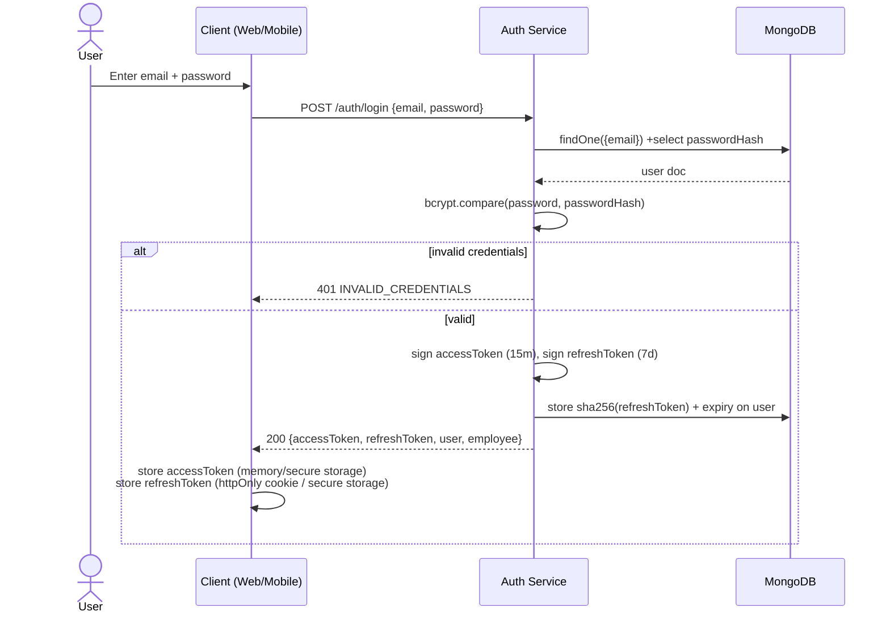
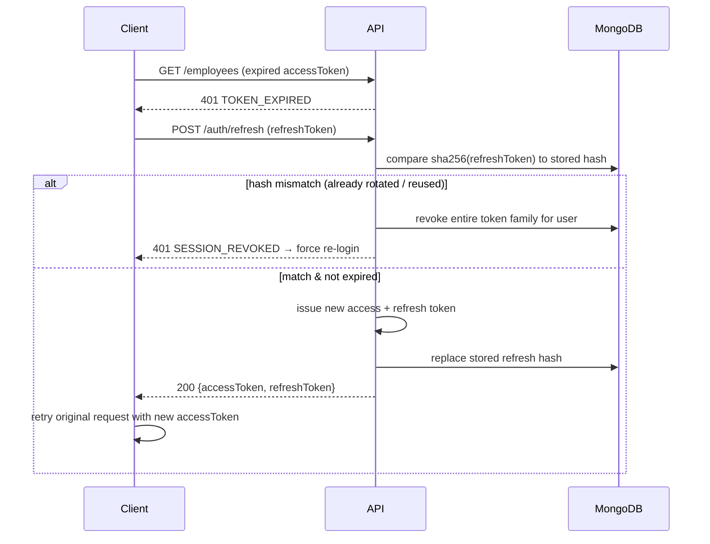

# 07 — Authentication Flow

## 1. Token Strategy

| Token | Lifetime | Storage (Web) | Storage (Mobile) | Contains |
|---|---|---|---|---|
| Access token | 15 min | in-memory (React state/Zustand, **not** localStorage) | `flutter_secure_storage` (Keychain/Keystore) | `sub` (userId), `role`, `employeeId`, `iat`, `exp` |
| Refresh token | 7 days, rotated on every use | httpOnly, `Secure`, `SameSite=Strict` cookie | `flutter_secure_storage` | `sub`, `tokenFamily`, `iat`, `exp` |

- Access tokens are never persisted to disk on web (XSS mitigation) — held in memory and re-derived from a silent `/auth/refresh` call on app load.
- Refresh tokens are **rotated**: each `/auth/refresh` call issues a new refresh token and immediately invalidates the old one (its hash is replaced in `users.refreshTokenHash`). Reuse of an already-rotated refresh token revokes the entire token family (all sessions for that user) — standard rotation-detection defense against stolen-refresh-token replay.
- Only the **hash** (SHA-256) of the current refresh token is stored server-side, never the raw token — mirrors password-hash practice so a DB leak doesn't hand out usable tokens.

## 2. Login Sequence

## 3. Silent Refresh (Axios/Dio interceptor)

## 4. Forgot / Reset Password

1. `POST /auth/forgot-password {email}` → server always returns 200 (no user enumeration), and if the account exists, generates a random 32-byte token, stores `sha256(token)` + 15-min expiry on the user, emails a link `https://app/reset-password?token=...`.
2. `POST /auth/reset-password {token, newPassword}` → server hashes the incoming token, matches against `passwordResetTokenHash` + checks expiry, sets new `passwordHash`, clears the reset fields, and **revokes all existing refresh tokens** for that user (forces re-login everywhere).

## 5. Change Password (authenticated)

`POST /auth/change-password {currentPassword, newPassword}` — requires a valid access token **and** re-confirmation of the current password before allowing a change, then revokes all other sessions' refresh tokens except the current one.

## 6. Role-Based Access Control (RBAC)

Roles: `super_admin` > `hr` > `manager` > `employee` (not a strict hierarchy for permissions — modeled as an explicit matrix, not inheritance, to avoid accidental over-privilege).

| Module / Action | Super Admin | HR | Manager | Employee |
|---|:---:|:---:|:---:|:---:|
| Manage users (create/deactivate) | ✅ | ✅ (non-admin roles) | ❌ | ❌ |
| Employee CRUD | ✅ | ✅ | 👁 (own team, read-only) | 👁 (own profile, limited fields) |
| Department CRUD | ✅ | ✅ | ❌ | ❌ |
| Attendance — punch in/out | ✅ | ✅ | ✅ | ✅ |
| Attendance — view all / reports | ✅ | ✅ | 👁 (own team) | 👁 (own only) |
| Attendance — correct/approve | ✅ | ✅ | ✅ (own team, approve-only) | ❌ |
| Geofence / QR management | ✅ | ✅ | ❌ | ❌ |
| Face registration | ✅ (any) | ✅ (any) | ❌ | ✅ (self) |
| Leave — apply/cancel | ✅ | ✅ | ✅ | ✅ |
| Leave — approve/reject | ✅ | ✅ (company-wide) | ✅ (own team) | ❌ |
| Leave types / holiday calendar | ✅ | ✅ | ❌ | ❌ |
| Shift management / assignment | ✅ | ✅ | ❌ | 👁 (own shift) |
| Payroll — configure salary | ✅ | ✅ | ❌ | ❌ |
| Payroll — run/release | ✅ | ✅ | ❌ | ❌ |
| Payslips — view | ✅ | ✅ | 👁 (own team, summary) | 👁 (own only) |
| Notifications — broadcast | ✅ | ✅ | ❌ | ❌ |
| Analytics dashboard | ✅ | ✅ | 👁 (own team) | ❌ |
| Audit logs | ✅ | ❌ | ❌ | ❌ |

`✅` full access · `👁` read-only / scoped access · `❌` no access. Enforced by `rbac.middleware.ts`'s `requireRole([...])` plus a scoping check in the service layer (e.g. a Manager's `/attendance` query is auto-filtered to `managerId === req.user.employeeId`).

## 7. Password & Account Security

- Passwords hashed with **bcrypt, cost factor 12**; minimum policy enforced client- and server-side (8+ chars, at least 1 number + 1 letter).
- Account lockout: 5 consecutive failed logins → 15-minute lockout (tracked in Redis by `email+ip`), independent of the global rate limiter.
- `mustChangePassword` flag forces a password reset on first login for accounts created by an admin with a temporary password.
- All auth events (`login`, `login_failed`, `logout`, `password_reset`, `token_reuse_detected`) are written to `auditlogs`.
