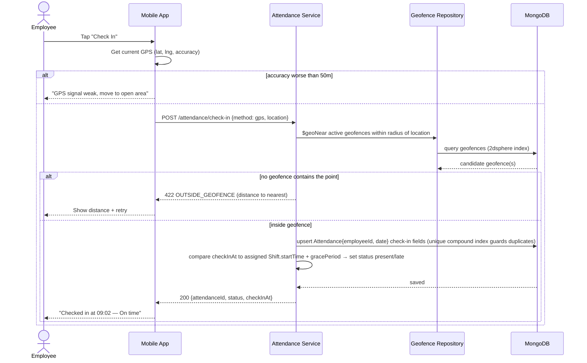
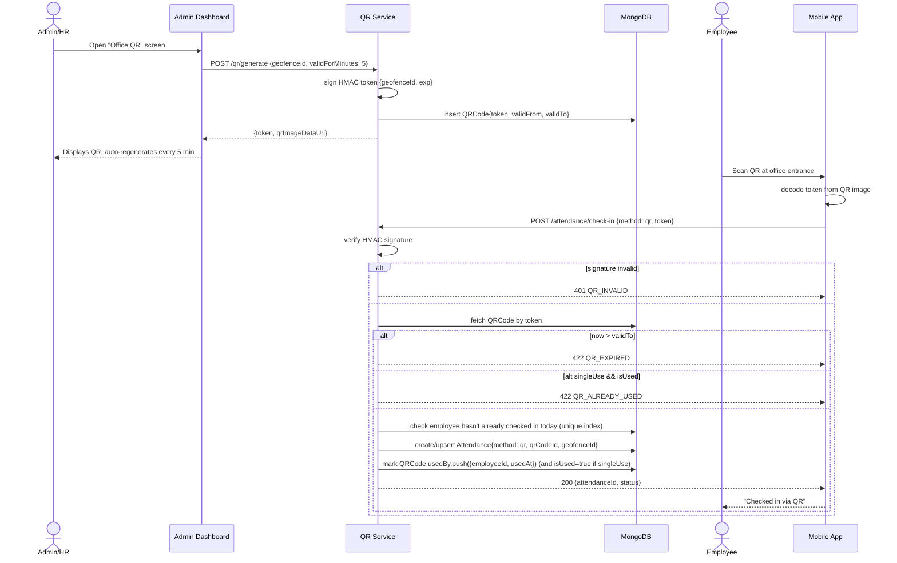
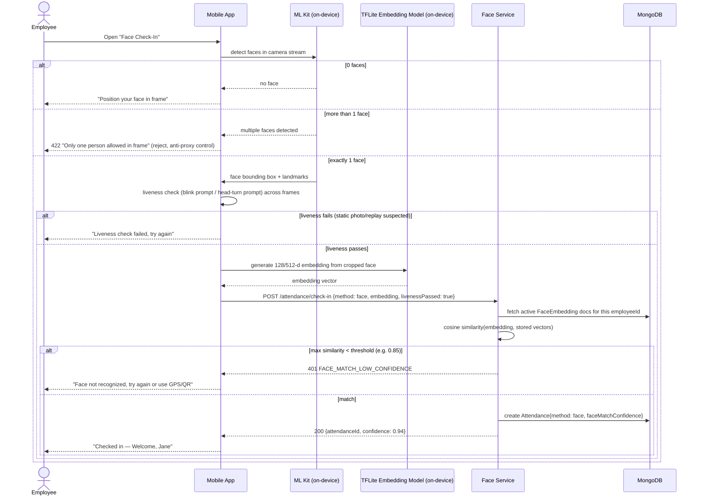
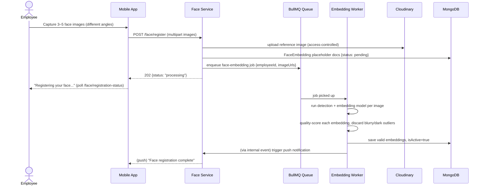
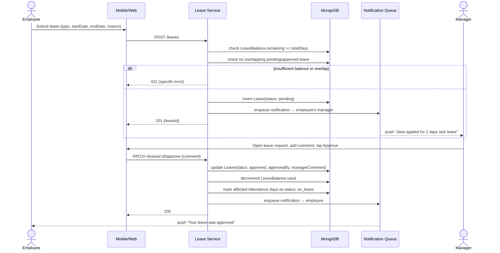
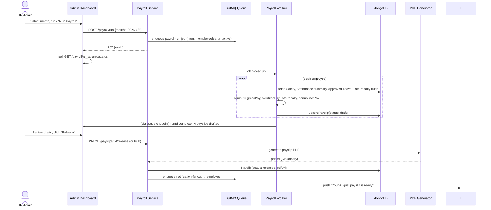
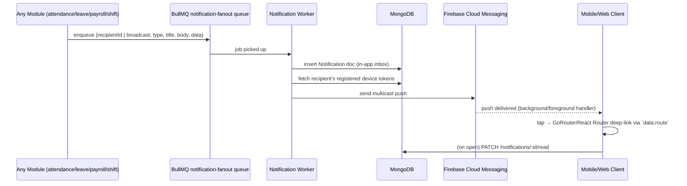

# 08 — Sequence Diagrams

Login and token-refresh sequences live in [07 — Authentication Flow](07-authentication-flow.md#2-login-sequence). This document covers the remaining core flows.

## 1. GPS Attendance Check-In



## 2. QR Attendance (Generate → Scan → Validate)



**Anti-fraud notes**: token is HMAC-signed server-side (not just an opaque ID) so a photographed/forwarded QR can't be forged; short `validForMinutes` window limits replay; `singleUse` mode + `usedBy` log prevents one scan being shared among multiple employees; every scan attempt (including rejected ones) is written to `auditlogs` for pattern review (see [Phase 15 AI anomaly detection](../../README.md)).

## 3. Face Recognition Attendance



## 4. Face Registration



## 5. Offline Attendance Sync

```mermaid
sequenceDiagram
    actor E as Employee
    participant M as Mobile App
    participant Hive as Local Store (Hive)
    participant API as Attendance Service
    participant DB as MongoDB

    Note over M: Device has no internet
    E->>M: Tap "Check In" (GPS method)
    M->>M: capture GPS + timestamp locally
    M->>Hive: save PendingPunch{clientGeneratedId: uuid, type: check_in, ...}
    M-->>E: "Saved offline — will sync when online" (optimistic UI, marked pending)

    Note over M: Connectivity restored
    M->>M: connectivity listener fires
    M->>Hive: read all unsynced PendingPunch records (FIFO by occurredAt)
    M->>API: POST /attendance/sync {punches: [...]}
    API->>API: for each punch, check clientGeneratedId against Attendance.clientGeneratedId (unique sparse index)
    alt already applied (duplicate network retry)
        API-->>M: {clientGeneratedId, status: "duplicate"}
    else new + valid (geofence/shift checks re-run server-side using the punch's original occurredAt)
        API->>DB: apply punch, tag syncStatus: synced
        API-->>M: {clientGeneratedId, status: "applied", attendanceId}
    else conflicting (e.g. a check-in already exists for that day from another device/method)
        API->>DB: keep first-write, flag second as syncStatus: conflict
        API-->>M: {clientGeneratedId, status: "conflict", serverRecord}
    end
    M->>Hive: mark each punch per its returned status; delete "applied"/"duplicate", surface "conflict" to user for manual resolution
    M-->>E: badge clears / conflict banner shown
```

**Conflict resolution policy**: server is always the source of truth once a record exists; conflicting local punches are never silently dropped — they're surfaced to the employee ("Your 9:00 AM check-in was already recorded via QR by someone using this device — contact HR if this wasn't you") and logged to `auditlogs` for the anomaly-detection pass in Phase 15.

## 6. Leave Application & Approval



## 7. Payroll Generation



## 8. Push Notification Fan-out


