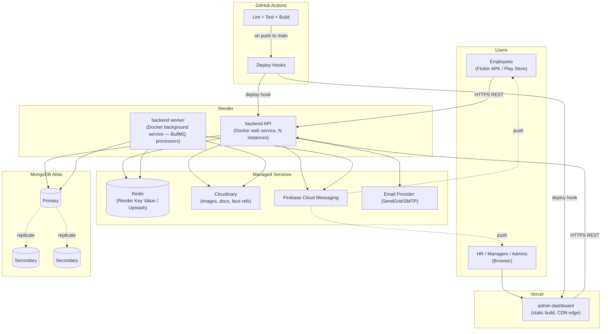
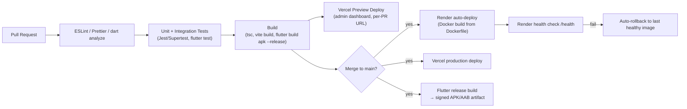

# 09 — Deployment Architecture

## 1. Environments

| Environment | Backend | Admin Dashboard | Database | Purpose |
|---|---|---|---|---|
| `local` | Docker Compose (API + Mongo + Redis) | Vite dev server | Local Mongo container | Day-to-day development |
| `staging` | Render (free/starter instance) | Vercel preview deployment (per-PR) | Atlas shared cluster (`M0`/`M2`) | QA, demo, integration testing |
| `production` | Render (standard instance, autoscale-ready) | Vercel production | Atlas dedicated cluster (`M10`+) with backups | Real users |

## 2. Deployment Diagram



## 3. CI/CD Pipeline



Workflows (`.github/workflows/`):
- `ci-backend.yml` — lint, typecheck, `jest`, build Docker image on every PR touching `backend/`.
- `ci-admin.yml` — lint, typecheck, `vitest`/component tests, `vite build` on every PR touching `admin-dashboard/`.
- `ci-mobile.yml` — `flutter analyze`, `flutter test`, `flutter build apk --release` on every PR touching `mobile-app/`.
- `deploy.yml` — on push to `main`: triggers Render deploy hook + Vercel production deploy; uploads the signed APK as a GitHub Release asset.

## 4. Infrastructure Details

| Concern | Detail |
|---|---|
| Backend process model | Stateless Express instances behind Render's load balancer; horizontal scale by increasing instance count — no in-memory session state (JWT is stateless, rate-limit counters live in Redis) |
| Background workers | Separate Render **background worker** service (not a web service) running the same image with `CMD ["node", "dist/jobs/worker.ts"]`, scaled independently from the API |
| Secrets | Render/Vercel environment variable dashboards; never committed; `.env.example` documents required keys without values |
| TLS | Terminated at Render/Vercel edge automatically |
| DNS | `api.ai-management-system.app` → Render, `admin.ai-management-system.app` → Vercel, both via CNAME |
| Health checks | `GET /health` (liveness: process up) and `GET /health/ready` (readiness: Mongo + Redis connectivity) wired to Render's health-check config |
| Logging | Winston JSON logs → Render's log stream; optional drain to a log aggregator (e.g. Better Stack) for production |
| Error tracking | Sentry SDK on both backend and admin dashboard (and Flutter's `sentry_flutter` for the mobile app) — captures unhandled exceptions with release/version tagging |
| Backups | Atlas continuous backups with point-in-time recovery (production cluster); daily snapshot retention 7 days minimum |
| Disaster recovery | Atlas automated failover (replica set, <30s typically); Render redeploys from the last successful image on crash-loop; RTO target < 1 hr, RPO target < 5 min (Atlas PITR) |
| Audit log retention | 3 years minimum (compliance default), stored in a dedicated collection, excluded from routine TTL cleanup jobs |
| Mobile distribution | Internal testing via direct signed APK (GitHub Release / Firebase App Distribution); production via Play Store internal/closed track before public release |

## 5. Configuration & Secrets (`.env` keys, values never committed)

```
NODE_ENV=
PORT=
MONGO_URI=
JWT_ACCESS_SECRET=
JWT_REFRESH_SECRET=
JWT_ACCESS_EXPIRY=15m
JWT_REFRESH_EXPIRY=7d
REDIS_URL=
CLOUDINARY_CLOUD_NAME=
CLOUDINARY_API_KEY=
CLOUDINARY_API_SECRET=
FIREBASE_PROJECT_ID=
FIREBASE_CLIENT_EMAIL=
FIREBASE_PRIVATE_KEY=
SMTP_HOST= / SMTP_USER= / SMTP_PASS=
CORS_ALLOWED_ORIGINS=
FACE_MATCH_THRESHOLD=0.85
QR_DEFAULT_VALID_MINUTES=5
RATE_LIMIT_WINDOW_MS=
RATE_LIMIT_MAX=
SENTRY_DSN=
```

## 6. Scaling Path (as usage grows)

1. **Vertical first**: bump Render instance size / Atlas tier — cheapest lever, no code change.
2. **Horizontal API**: increase Render instance count (already stateless — safe by design).
3. **Read scaling**: route analytics/report queries to Atlas secondary reads (`readPreference: secondaryPreferred`) once dashboard aggregation load grows.
4. **Split the face-recognition workload**: extract `face-recognition` module into its own service (already isolated behind a service-layer boundary per [01 §2](01-software-architecture.md#2-architectural-style)) if embedding volume or model size outgrows the shared worker.
5. **Vector search**: move face-embedding similarity from in-app brute force to Atlas Vector Search once headcount passes ~5,000 registered faces.
6. **CDN for uploads**: Cloudinary already serves as a CDN; no change needed at this stage.
7. **Multi-region**: only if the customer base becomes geographically distributed enough to need region-local latency — out of scope for v1.
